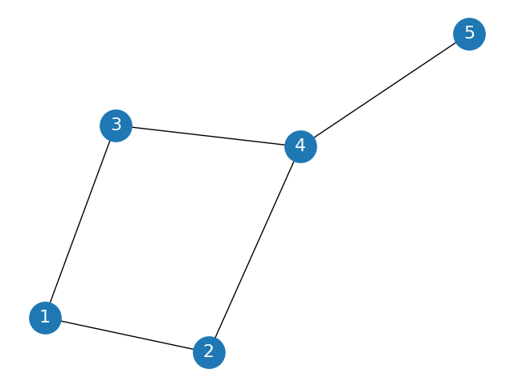

# 交叉熵损失与参数更新
## 数据准备
对于下面这样一个网络：

假如我们得到了节点i的嵌入表示$z_i$数据如下：
$$
id,x_0,x_1,x_2,x_3\\
1,0.5,0.6,0.7,0.8\\
2,0.3,0.8,0.3,0.4\\
3,0.7,0.9,0.6,0.9\\
4,0.2,0.1,0.2,0.3\\
5,0.8,0.4,0.3,0.2\\
$$
为了方便说明，我们来处理一个对节点进行有监督分类的问题。
假设我们要对节点的嵌入表示进行分类
真实的类别如下：
1,3，属于第0类
2,4，属于第1类
5，属于第2类

## 分类层
我们对每个节点经过一个全连接层，我们随机初始化w0,w1,w2三个4维（嵌入向量维数）的权重向量（结果保留两位有效数字，下同）。
$w_0 = [0.17,0.4,-0.14,0.51]$
$w_1 = [0.75,-0.04,0.67,-0.18]$ 
$w_2 = [0.53,-0.04,0.4,0.77]$ 
$b_0,b_1,b_2 = 0.05,-0.11,-0.32$ 
$w_i,b_i$对应将节点向量转化为节点属于i类的过程的一些权重；

于是对节点$z_1$,我们得到：

$h_1 = [z_1w_0+b_0,z_1w_1+b_1,z_1w_2+b_2]\\ 
= [0.68, 0.57, 0.82]$
<!-- (这里的sigma指的是对每个分量取sigmoid函数) -->
类似地，我们得到
$
% p_1 = 
%  [0.58, 0.21, 0.23] [0.9, 0.62, 0.95] [0.25, 0.12, 0.09] [0.47, 0.55, 0.4]
h_2 = [0.58, 0.21, 0.23] \\
h_3 = [0.9, 0.62, 0.95] \\
h_4 = [0.25, 0.12, 0.09]\\
h_5 =  [0.47, 0.55, 0.4]\\
$

## softmax矩阵
<!-- 
上面得到的这些向量，本质上依然是节点的一个表征向量。 -->
softmax函数作为一种归一化函数，可以将一组任意实数转换为一个概率分布，常用于多分类问题，其表达式为：

$\text{softmax}(z_i) = \frac{exp(z_i)}{\sum_{j=1}^K exp(z_j)}, \quad i=1,\ldots,K$
K为分类的类别个数，z_i为实际上是向量z的第i个分量，分类问题中，对于向量$z$而言,softmax的函数值也就是$z$属于第$i$类的概率。

在这里，以$h_1$为例，softmax的表达式可以写成：

$\text{softmax}(h_{1}[i]) = \frac{exp(h_1[i])}{\sum_{j=1}^K exp(h_1[j])}, \quad i=1,2,3$
$h_1[i]$表示$h_1$中第i个分量。

<!-- 其中，z是一个K维向量，i是z中第i个元素，exp(x)实际上就是$e^x$,$z[i]$表示z中第i个向量;分类问题中，对于向量$z$,softmax的函数值也就是$z$属于第$i$类的概率。 -->
<!-- 将上面这些数据再经过一个sigmoid函数，就将其转化为（0,1）之间。 -->

于是我们将$h_1,h_2,...,h_5$每个向量传入softmax函数，得到节点属于各类别的概率分布：

$p_1 = [0.33, 0.29, 0.38]\\
p_2 = [0.42, 0.29, 0.29] \\
p_3 =  [0.36, 0.27, 0.37] \\
p_4 =  [0.37, 0.32, 0.31] \\
p_5 =  [0.33, 0.36, 0.31]\\
$
于是根据我们上面所提到的，$p_1$中最大的是第3列，也就是说，根据我们的结果，节点1属于第2类的概率最大。

## 交叉熵损失

如是我们可以得出，节点2,4属于第0类，节点5属于第1类，节点1,3属于第2类，这个结果和实际分类相差比较大，所以参数w和b需要重新训练。

为此我们引入交叉熵损失函数：

$$L = - \frac{1}{N} \sum_{i = 1,2,..,N} log \frac{exp(h_i[s])}{ \sum_{q = 0,1,2} exp(h_i[q])}$$

其中N是节点数量5，s表示节点i所属的真实类别。
我们可以看到后面这个分式实质上就是节点i在真实类别s上对应的softmax函数值；所以实际上损失函数的目标，也就是让节点i被分到真实类别的概率最大化。

$$L = - \frac{1}{N} \sum_{i = 1,2,..,N}log(p_i[s])$$

<!-- 当y_i为 -->

之前提到的节点的真实的类别如下：
1,3，属于第0类
2,4，属于第1类
5，属于第2类

前面已经计算出了节点对应的softmax函数值$z_1$到$z_5$
所以，在这里
$$ L = -\frac{1}{5}(ln(p_1[0]p_2[1]p_3[0]p_4[1]p_5[2]))\\
 = -1/5(ln(0.33×0.29×0.36×0.32×0.31)) $$
 
 我们最终求出此次的损失函数值为-1.1358

## 反向传播更新参数

此时，我们已经求出了损失函数，下面要做的就是将损失函数对参数求梯度然后反向传播了

$$ \frac{\partial L}{\partial w_t} 
 = \frac{\partial L}{\partial h_i}\frac{\partial h_i}{\partial p_i}\frac{\partial p_i}{\partial w_i}$$

[具体求导过程](https://zhuanlan.zhihu.com/p/99923080)

最终得出的结果为：

$$ \frac{\partial L}{\partial w_i}
  = \sum_{n = 1}^N(p_n(i)-1)x_n\\$$
其中p(i)指的是向量$x_n$属于第i类的概率(softmax函数值);N为节点数5.

<!-- 对节点1，实际上属于第0类， -->
所以
$$ \frac{\partial L}{\partial w_0}
  = (p_1[0]-1)z_1 +(p_2[0]-1)z_2 +...+(p_5[0]-1)z_5$$

这样的话，最终得到的梯度结果是一个4维的向量
$\frac{\partial L}{\partial w_0} = [-1.62,-1.77,-1.29,-1.73]$

梯度下降法更新参数：
$W := W - \alpha\frac{\partial L}{\partial W} $

$w_0 = [0.17,0.4,-0.14,0.51]$,假如我们设定$\alpha = 0.2$

$w_0 := w_0 - 0.2 \frac{\partial L}{\partial W}\\
 = [0.49,0.75,0.12,0.86]$
对其他参数$w_1$,$w_2$也作类似操作。
特别地，对于$b_i$

$$ \frac{\partial L}{\partial b_i}
  = \sum_{n = 1}^{N}(p_n(i)-1)\\$$

这样就完成了一轮参数更新。
<!-- $b_0 $ -->

