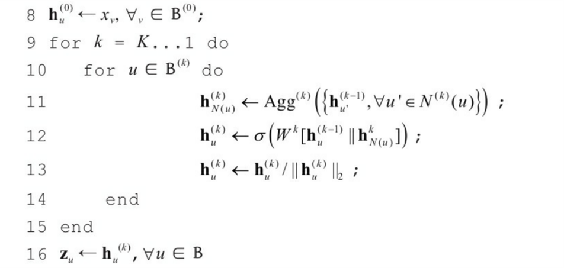
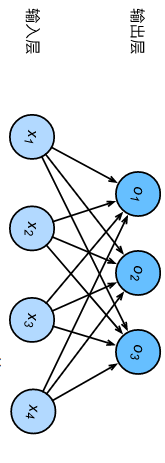

## 数据准备
对于下面这样一个图：

假如我们想要节点的嵌入输出的outputdim为2维的，输入的图对应初始特征数据如下：
$$
id,x_0,x_1,x_2,x_3\\
1,0.5,0.6,0.7,0.8\\
2,0.3,0.8,0.3,0.4\\
3,0.7,0.9,0.6,0.9\\
4,0.2,0.1,0.2,0.3\\
5,0.8,0.4,0.3,0.2\\
$$

<!-- # 1. 邻居节点聚合 -->
我们先完成第一步，邻居节点聚合。
这一步可以采用多种聚合算子，我们在此以平均聚合算子与平均池化聚合算子为例。
##  平均聚合算子 
$AVERAGE(h_j)$

$$h_4 ^{(0)} =[0.2,0.1,0.2,0.3]^T$$
节点4的邻接节点为2，3，5
我们用平均聚合算子AVERAGE(h)对2，3，5这三个节点的信息进行聚合：
  $$Agg^{(1)}(h_2(0),h_3(0),h_5(0))$$ 
 就是对这三个向量对应值相加取均值，得到：
 $h_{N(4)}^{(1)}=[0.6,0.7,0.4,0.5]$

 
由上面我们得到$h_4^{(1)}$为：
 $$\sigma(W^{(1)}[h_u^{(0)},h_{N(u)}^{(1)}])
 =\sigma(W^{(1)}[0.2,0.1,0.2,0.3,0.6,0.7,0.4,0.5]^T)$$
为了使得输出是一个$3×1$的向量，我们设置$W^{(1)}$为一个 $2×8$ 的矩阵，比如我们初始化为：

$$1,0,0,0,1,0,1,0\\0,1,0,1,0,0,1,0$$
<!-- [1.2 0.8] -->
与上面的向量相乘，得到$[1.2,0.8]^T$

将其代入激活函数后进行归一化，就正式得到
$$h_4^{(1)} = 
[0.83205029,0.5547002 ]^T$$
对第一层的其他节点的操作也是类似的。

## 平均池化聚合算子
平均池化聚合算子，就是$AVERAGE[\sigma(Wh+b)]$,$\sigma$是激活函数(ReLU)
具体怎么做的呢？
我们待处理的邻接节点：
$h_2^{(0)} = [0.3,0.8,0.3,0.4],\\
h_3^{(0)} = [0.7,0.9,0.6,0.9],\\
h_5^{(0)} = [0.8,0.4,0.2,0.3]$
此刻我们在此添加一个dense层（全连接层）。这里全连接层是指：对这每个节点，其向量的每个分量经过了一个全连接层。

对于$h_j$，输出是：$ReLU(Wh_j+b)$

我们引入一个权重矩阵$W$，它是input dim×hidden dim维度的，在这里input dim是4维，我们设定这个隐藏层的输出维度为3，那么W就是一个3×4的矩阵；对于同一层中的每个邻居节点，W是固定的。
b就是一个hidden_dim(3)维的向量。

所以说线性变换的输出就是

<!-- (这个图片) -->

这样的话:
对于节点2，我们的输入$h_2{(0)} = [0.3,0.8,0.3,0.4]$是4维的。
所以
$$ o1 = w11x1+w12x2+w13x3+w14x4+b1\\
o2 = w21x1+w22x2+w23x3+w24x4+b2\\
o3 = w31x1+w32x2+w33x3+w34x4+b3$$
所以实际上 $o = Wh_2{(0)}$

$W$ 权重的初始化有多种方式，我们在此用随机数初始化
| col0 | col1 | col2 | col3|
|------|------|------|-----|
 | 0.17 | 0.4| -0.14|0.51|
 | 0.75 | -0.04 |0.67|-0.18|
 |0.53 | -0.04 | 0.4 |0.77|

 <!-- (实际上是3×4维的，) -->

 $b = [0.66,-0.58,-0.64]$

<!-- || 0.66 -0.58 -0.64]] -->
对于2,3,5,得到的$Wh_j+b$分别为
$[1.19,-0.26,-0.08]\\
[1.51,0.15,0.63] \\
[1.08,0.08,0.08]$

<!-- || 1.26 -0.01  0.21]] -->
<!-- $b:
% |0.38,0.62,-0.95]
| 0.66, -0.58, -0.64]$ -->

 将上述三个向量经过激活函数ReLU：
 就得到(对每个分量分别取ReLU)
$[1.19, 0, 0]\\
[1.51,0.15,0.63] \\
[1.08,0.08,0.08]$

对上面三个向量取均值
 $h_{N(4)}^{(0)} = AVERAGE(ReLU(Wh_j+b)) = [1.26,0.08,0.24]$

这样我们就完成了第一步；

<!-- 对于$AVERAGE(Wh_j+b)$
我们先看$Wh_2^{(0)} + b$ -->

<!-- 我们将其转成节点数量 -->

<!-- 这里的 -->

<!-- # 2 聚合 -->

刚刚我们得到了$h_{N(4)}^{(1)}$,而 $h_4^{(0)} = [0.2,0.1,0.2,0.3]$

因为经过了一个平均池化聚合，邻居节点的输出变成了3维的，所以GraphSAGE对当前节点与邻居节点分别引入了一个权重矩阵：

$$ReLU(W^{(1)}[h_u^{(0)},h_{N(u)}^{(1)}])
 = ReLU(W_{self}^{(1)}h_4^{(0)}+W_{neigh}^{(1)}h_{N(4)}^{(1)})$$

因为我们想要输出是2维的，那么
$W_{self}^{(1)}$和$W_{neigh}^{(1)}$就分别是4×2维的和3×2维的;
当然，我们也可以在括号里加一个二维的bias向量作偏置。
<!-- 类似上面，假如我们要在这里加一个bias的话，bias的维度应当是一个2维的向量 -->
将计算得到的结果向量经过一个ReLU函数(依然是对各分量分别取ReLU)，再除以它的模进行归一化后输出，就完成了聚合操作。
<!-- 这样得到一个 -->
<!-- 
由上面我们得到$h_4^{(1)}$为：
 $$\sigma(W^{(1)}[h_u^{(0)},h_{N(u)}^{(1)}])
 =\sigma(W^{(1)}[1.26,0.08,0.24]^T)$$
为了使得输出是一个$3×1$的向量，我们设置$W^{(1)}$为一个 $3×4$ 的矩阵，比如我们设为： -->

<!-- 
$$1,0,0,0\\0,1,0,1\\0,0,1,0$$

与上面的向量相乘，得到$[0.4,0.7,0.2]^T$

将其代入激活函数后进行归一化，就正式得到
$$h_4^{(1)} = 
[0.48154341,
 0.84270097,
 0.24077171]^T$$

对第一层的其他节点的操作也是类似的。

假如我们要求第二层的$h_4^{(2)}$
此时得到的上一层输出为：

$$id,x_0,x_1,x_2\\1,0.1,0.2,0.3\\2,0.1,0.3,0.2\\3,0.5,0.2,0.3\\4,0.3,0.2,0.1\\5,0.4,0.5,0.6$$
我们的做法和第一层是一样的，只不过每个节点的输入变成3维的了；

先对节点4的邻接节点的上一层输出进行均值聚合，得到一个3维向量；

它再与节点4的上一层输出进行缀连，得到一个6维向量。

这样的话，$W_4^{(2)}$就是$3×6$维的一个矩阵，将我们这个6维向量变换成3维。之后也是激活函数，归一化，就得到了输出$h_4^{(2)}$。

也就是说，假如我们输入是$d^{in}$维度的，设定输出为$d^{out}$维度的,那么第一层的权重矩阵$W^{(0)}$是$d^{out}×2d^{in}$维的;

对于之后的每一层，权重矩阵都是$d^{out}×2d^{out}$维的。
 -->
